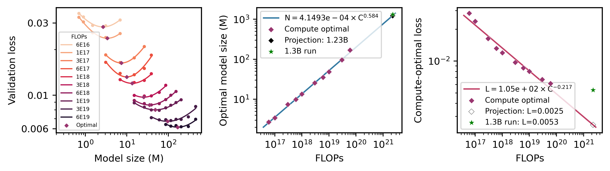

# Neural Scaling Laws for Weather Forecasting

A distributed (Swin) Transformer framework for weather forecasting, designed for neural scaling laws research on ERA5 data. The code is built for multi-GPU training with hybrid parallelism (Data Parallel + Tensor Parallel + Spatial Parallel). The code implements continual learning with periodic cooldowns for computational efficiency.



## Overview

This codebase implements a simple Swin Transformer architecture for weather prediction with:

- **Hybrid Parallelism**: Combines Data Parallel (DP), Tensor Parallel (TP), and 2D Spatial Parallel (SP1, SP2) for efficient multi-node training
- **Hydra Configuration**: Modular, composable configuration system
- **NVIDIA Transformer Engine**: Fused kernels, drop-in Tensor Parallelism, general performance optimizations
- **DALI DataLoaders**: Performant I/O that will overlap with compute 
- **Wandb Integration**: Experiment tracking and logging
- **Checkpoint-Restart**: Automatic mid-epoch checkpoint-restart (for cooldowns) through stateful dataloaders

---

## Installation

### Docker Environment

The recommended environment is a Docker/Shifter image built from the NVIDIA GPU Cloud PyTorch container. The main build file is [`docker/Dockerfile`](docker/Dockerfile), which installs:

- Parallel HDF5 with MPI support
- `torch-harmonics` for spherical transforms (AMSE loss)
- `gcsfs` for inference for benchmark models like GraphCast and HRES
- Hydra, wandb, and other Python packages for training, inference, and metric computations

Build and push the image from the repository root with:

```bash
bash docker/build.sh
```

The build script uses `podman-hpc`, passes `nvc_tag=25.06-py3`, tags the image as `registry.nersc.gov/dasrepo/shas1693/weather-pytorch:25.06`, and pushes it to the NERSC registry. If you use a different registry, tag, or base NGC PyTorch version, edit [`docker/build.sh`](docker/build.sh). You need to log in first:

```bash
podman-hpc login registry.nersc.gov
shifterimg login registry.nersc.gov
```

then finally run:
```bash
shifterimg pull registry.nersc.gov/dasrepo/shas1693/weather-pytorch:25.06
```
to make the image available to shifter and update the sbatch/launch scripts. 

---

## Configuration with Hydra

The configuration system uses [Hydra](https://hydra.cc/) for composable configs. All configs are in the `config/` directory.

### Structure

```
config/
├── default.yaml           # main entry point, composes all defaults
├── data/
│   └── latlon_025deg.yaml # ERA5 0.25 deg dataset config
├── model/
│   └── swin.yaml          # Swin Transformer architecture
├── optimizer/             # optimizer and LR scheduler configs (includes cooldown setup)
│   ├── adam.yaml
│   └── adamw.yaml
├── loss/
│   ├── mse.yaml           # standard MSE loss
│   ├── amse.yaml          # adjusted MSE (using SHTs etc.)
├── parallelism/
│   └── hybrid.yaml        # model parallel settings
├── train/
│   └── standard.yaml      # training hyperparameters
├── logging/
│   └── wandb.yaml         # Wandb project settings
├── inference/
│   └── deterministic_025deg.yaml
├── profiler/
│   └── nvidia.yaml        # Nsight Systems profiling
├── hydra/
│   └── basic.yaml         # Hydra output directory settings
└── debug/
    └── check.yaml         # quick debugging config
```

### Default Configuration (`config/default.yaml`)

```yaml
defaults:
 - data: latlon_025deg
 - logging: wandb
 - loss: mse
 - model: swin
 - optimizer: adam
 - train: standard
 - parallelism: hybrid
 - hydra: basic
 - inference: deterministic_025deg
 - profiler: nvidia
 - _self_
 - debug: null

run_name: 'default'
run_tag: '00'
sweep_id: null
disable_auto_resume: false
```

Note that all data and output paths are container paths. The code reads data from `/data` and writes the active job's outputs to `/expts`. Training checkpoints are written under `/expts/{run_name}/{run_tag}`. In inference jobs, `/registry` points to the training experiment root so inference can read trained checkpoints while writing inference outputs to a separate `/expts` mount.

### Overriding Config at Runtime

Override any config value from the command line:

```bash
python train.py model.embed_dim=768 model.depth=24 optimizer.lr=1e-4
```

You can also enable debug mode (short epochs, no wandb) just for testing:

```bash
python train.py debug=check
```

Here's an example of a full train run (use `run_name` and `run_tag` to identify the run in Wandb):
```bash
python train.py run_name=scaling run_tag=p4-e1024-d16-lr5em4 \
    data.batch_size=16 optimizer.lr=0.0005 \
    parallelism.sp2=2 parallelism.sp1=1 \
    train.num_rollout_steps=1 \
    model.patch_size=4 model.embed_dim=1024 model.depth=16 model.num_heads=16 model.window_size=[9,18] \
    optimizer=adamw train.clip_grad_norm=1.0 optimizer.max_iterations=48000 parallelism.micro_batch_size=1
```

For inference, you can run:
```bash
python inference.py run_name=scaling run_tag=p4-e1024-d16-lr5em4 \
    inference.checkpoint=/registry/scaling/p4-e1024-d16-lr5em4/checkpoints/ckpt_best.tar \
    inference.checkpoint_hyperparams=/registry/scaling/p4-e1024-d16-lr5em4/hyperparameters.yaml \
```

To run benchmarks you add: `inference.run_benchmark=graphcast` or `inference.run_benchmark=hres` for GraphCast and HRES respectively. This will just pull the benchmark predictions from GCS and compute the metrics. Note that, due to GCS, this is a bit slow and could take several minutes per initial condition for the benchmakr runs whereas the Swin models should be done in a minute or so per initial condition (40G A100).

---

## Model Architecture

### Swin Transformer (`models/swin.yaml`)

The Swin Transformer is configured via `config/model/swin.yaml`:

```yaml
arch: 'swin'
embed_dim: 1024       # embedding dimension
patch_size: 4         # patch size for tokenization
depth: 12             # number of transformer blocks
window_size: [9,18]   # window size for attention [H, W]
num_heads: 16         # number of attention heads
dropout: 0.
mlp_ratio: 4          # MLP expansion ratio
coord_pos_embed: true # use coordinate-based positional embedding
```

### Key Features

- **Distributed Shifting Window Attention**: Window attention with distributed rolls
- **Temporal Context**: Spatiotemporal attention within spatial windows and full time with possible causal masking
- **Distributed Layers**: All layers distributed accordingly to SP and/or TP groups
- **Coordinate Positional Embedding**: positional embeddings from spatial+temporal coordinates (learnable also avail)
- **Transformer Engine**: Uses NVIDIA's `te.Linear` for optimized matrix operations (can use other TE functions as well)
- **Rollout**: Autoregressive rollout training with `TimeStepper` wrapper

We use temporal context of 1 everywhere for this dataset. However, this can be increased to longer contexts if needed.

### Input/Output

- **Input**: `(batch, temporal_context_window, channels, height, width)`
- **Output**: `(batch, 1, channels, height, width)` — predicts next timestep

---

### Parallelism Configuration

Configure in `config/parallelism/hybrid.yaml` or override:

```yaml
tp: 1                          # tensor parallelism (splits heads)
sp1: 1                         # spatial parallelism dim 1 (latitude)
sp2: 2                         # spatial parallelism dim 2 (longitude)
pp: 1                          # pipeline parallelism (not implemented)
order: 'sp1-sp2-tp-pp-dp'      # GPU group order for performance
backend: 'nccl'
micro_batch_size: 1            # per-GPU batch size (grad accum auto-computed)
use_transformer_engine: true   # use NVIDIA Transformer Engine
```

**Data Parallel (DP)**: Automatically computed as `world_size / (tp * sp1 * sp2)`

### Gradient Accumulation

Automatically calculated:
```
gradient_accum_steps = batch_size / (micro_batch_size * dp_size)
```
`batch_size` must be exactly divisible by `micro_batch_size * dp_size`.

---

## Submitting cluster jobs

The checked-in job scripts target Slurm with Shifter. They mount ERA5 data at `/data`, experiment outputs at `/expts`, and the training registry/checkpoint root at `/registry`.

- [`submit_batch.sh`](submit_batch.sh) runs `python train.py "$@"`.
- [`submit_batch_inference.sh`](submit_batch_inference.sh) runs `python inference.py "$@"`.

For Slurm batch jobs, edit [`batchsub.py`](batchsub.py) and run it to construct and submit the `sbatch` command:

```python
# in batchsub.py, configure:
mode = "train"
run_name = "scaling"
run_tag = "p4-e1024-d16-lr5em4"
nodes = 8
batch_size = 16
embed_dim = 1024
depth = 16
patch_size = 4
lr = 5e-4
sp1 = 1
sp2 = 2
```

Then run:

```bash
python batchsub.py
```

This prompts before submitting either [`submit_batch.sh`](submit_batch.sh) or [`submit_batch_inference.sh`](submit_batch_inference.sh), depending on `mode`. Change Slurm flags, the image name, and local filesystem mounts directly in those scripts for your machine/account.

Alternatively, you can just run `python train.py` (or `python inference.py` for inference) with the appropriate arguments by overriding Hydra configs as mentioned in the [Configuration with Hydra](#configuration-with-hydra) section.


---

## Unit Tests

The test suite validates distributed operations, model correctness, and loss functions.

### Running Tests

Tests require a multi-GPU environment. Use the test runner script:

```bash
bash tests/run_tests.sh tp=2 sp1=2 sp2=2 dp=2 nodes=4
```

Arguments:
- `tp`: Tensor parallel size
- `sp1`, `sp2`: Spatial parallel sizes
- `dp`: Data parallel size
- `nodes`: Number of nodes

Pass a test name or path to run a specific test, e.g. `bash tests/run_tests.sh test=test_all tp=2 sp1=2 sp2=2 dp=2 nodes=4`. 

| File | Description |
|------|-------------|
| `test_all.py` | (Default) End-to-end distributed model forward/backward correctness |
| `test_windows.py` | Window partition/reverse operations |
| `test_distributed_roll.py` | Distributed cyclic shift for shifted window attention |
| `test_compute_split_shapes.py` | Shape computation for spatial parallelism |
| `test_losses.py` | Loss function correctness |
| `test_metrics.py` | Metric computation |
| `test_dataloader.py` | Data loading pipeline |


---

## Data

### ERA5 Dataset

The default configuration uses ERA5 reanalysis at 0.25° resolution:

- **71 variables**: 6 surface + 5 pressure-level variables × 13 levels
- **Surface variables**: `u10m`, `v10m`, `t2m`, `tcwv`, `sp`, `msl`
- **Pressure variables**: `u`, `v`, `z`, `t`, `q` at levels 50-1000 hPa
- **Invariants**: Land-sea mask, orography, cos(latitude)

Configure in `config/data/latlon_025deg.yaml`:

```yaml
name: 'latlon_025deg_hdf5_1h'
loader: 'dali'                # 'dali' or 'pytorch' dataloaders
dt_scale: 6                   # timestep multiplier (6h steps)
batch_size: 64
invariants: ['lsm', 'orog', 'coslat']
valid_years: [2017]
test_years: [2018, 2019, 2020, 2021, 2022]
```

Data is mounted at `/data` in the container .

---

## Checkpointing

### Automatic Resume

Training automatically resumes from checkpoints if they exist:

```
/expts/{run_name}/{run_tag}/checkpoints/ckpt.tar
```

Disable with `disable_auto_resume=true`.

Inference examples use `/registry/{run_name}/{run_tag}` for checkpoint paths because inference job scripts mount `/registry` to the training experiment root and `/expts` to the inference-output directory.

### Branching (Cooldown)

Branch from a checkpoint with a new scheduler (e.g., for learning rate cooldown):

```bash
python train.py \
    train.branch_from=/path/to/ckpt_iter42000.tar \
    optimizer.scheduler=cooldown \
    optimizer.cooldown_from_iter=42000 \
    optimizer.cooldown_to_iter=50000 \
    optimizer.cooldown_fraction=0.05 
```

### Finetuning

Load weights but start fresh optimizer/scheduler:

```bash
python train.py train.finetune_from=/path/to/ckpt.tar <other_arguments>
```

---

## Profiling

Enable NVIDIA Nsight profiling and use this profile command in the run script:


```bash
NSYS_ARGS="--trace=cuda,cublas,nvtx --kill none -c cudaProfilerApi -f true"
PROFILE_DIR="/path/to/where/you/want/to/store/profiles"
mkdir -p "$PROFILE_DIR"
export PROFILE_CMD="nsys profile $NSYS_ARGS -o $PROFILE_DIR/profile-<run_name>-<run_tag>"
$PROFILE_CMD python train.py profiler.enabled=true
```

Profiles are saved to the output directory. 

---

## Project Structure

```
.
├── train.py              # training entry point
├── inference.py          # inference entry point
├── batchsub.py           # SLURM job configuration/submission
├── submit_batch.sh       # SLURM batch script
├── submit_batch_inference.sh # SLURM batch script for inference
├── config/               # Hydra configuration files
├── models/
│   ├── swin.py           # Swin Transformer base implementation
│   ├── swin_helpers.py   # attention blocks, window ops helpers for Swin
│   ├── mlp.py            # MLP
│   ├── layer_helpers.py  # distributed layer helpers
│   └── helpers.py        # model factory, TimeStepper wrapper for rollout
├── utils/
│   ├── trainer.py        # training loop with checkpointing, resume, cooldown, etc.
│   ├── inferencer.py     # inference loop with metrics computation, benchmarks, etc.
│   ├── losses.py         # loss functions
│   ├── comm.py           # communication utilities and group wire-ups
│   ├── data_utils.py     # dataset/dataloader utilities
│   ├── flops_utils.py    # FLOP counting for scaling analysis
│   ├── optimizer_utils.py # optimizer and scheduler utilities
│   ├── misc_utils.py     # miscellaneous utilities for metrics, viz, etc.
│   ├── profiler_utils.py # Nsight profiling utilities
├── distributed/
│   ├── helpers.py        # torch distributed helpers for AG, AR, RS, Rolls, Transpose, etc.
│   └── mappings.py       # Autograd functions for helpers and DDP 
├── tests/                # unit tests
└── docker/
    ├── Dockerfile        # NGC PyTorch-based training image
    └── build.sh          # podman-hpc build/push helper for NERSC
```

### Communication Groups

The codebase manages multiple overlapping communication groups (see `utils/comm.py` for more details; the ranks are generated by `utils/rank_generator.py` that is based on the [Megatron-LM codebase](https://github.com/NVIDIA/Megatron-LM)):

- `dp`: Data parallel group
- `tp`: Tensor parallel (attention head splitting)
- `sp1`: Spatial parallel (latitude dimension)
- `sp2`: Spatial parallel (longitude dimension)
- `sp1-sp2`: Combined spatial group
- `tp-sp1-sp2`: Combined model parallel group
- `dp-sp1-sp2`: Combined data and spatial parallel group (we used this in DDP for wgrad AR)

Each parameter has `comm_metadata` specifying how it's sharded and reduced:

```python
param.comm_metadata = {
    "sharded": ["tp", None],    # dimensions where param is split
    "shared": ["sp1-sp2"],       # groups where param is replicated
    "reduce": ["sp1-sp2"],       # groups for gradient reduction (done in DDP)
}
```


---

## Reference
If you find this codebase useful, please cite:

```
@article{subramanian2026neural,
  title={On Neural Scaling Laws for Weather Emulation through Continual Training},
  author={Subramanian, Shashank and Kiefer, Alexander and Nigmetov, Arnur and Gholami, Amir and Morozov, Dmitriy and Mahoney, Michael W},
  journal={arXiv preprint arXiv:2603.25687},
  note={ICLR 2026 Workshop on Foundation Models for Science: Real-World Impact and Science-First Design},
  year={2026}
}
```
